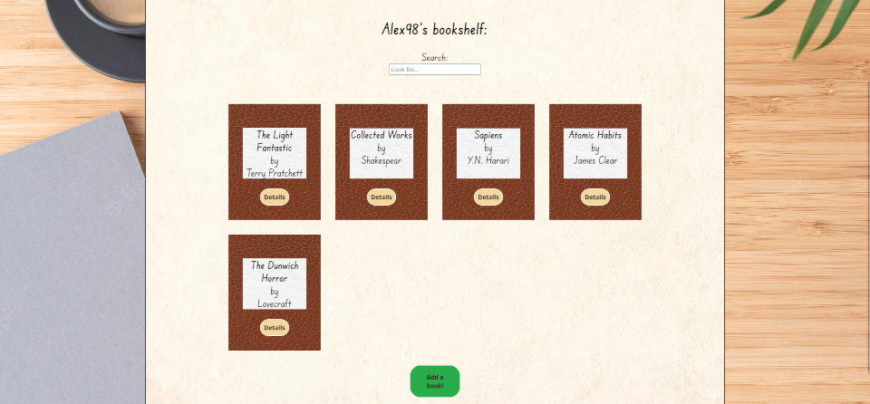
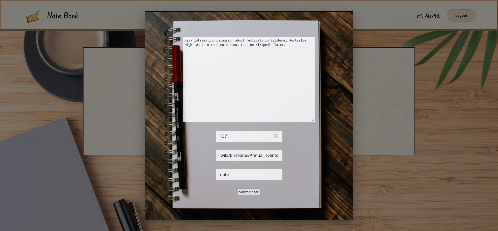

# Note Book

## Introduction

_Note Book_ is a web application for those who like to read a lot and take a lot of notes. Instead of having to skim through the pages of notepads or the books themselves to find that one quotation that you marked _somewhere_, Note Book allows you to add all your books to a digital collection, take as many notes and quotes for each book as you like and keeping them all in one place. You can also easily search for specific book titles or text passages and filter between notes and quotes, no matter how big your collection of books grows or how extensive your notes are. Let's get reading!

## Features

- Sign up for a free user account
- Add all your book to your personal digital collection
- Access all notes & quotations you took for each book
- Ability to include external links in your notes
- Search tool to find specific book titles or text passages with keywords
- Filter option to choose if only notes or quotes should be displayed

## Installation

After cloning this repository from Github, use the terminal to cd into the cloned parent folder, then run `npm install` inside **both** the /frontend and /backend folders each.

Create a new MySQL database and import the **note-book.sql** file (or copy & paste its content into the new database manually) in order to have the required tables.

In the /backend folder, rename the **.env.sample** file to just **.env** and replace the placeholder values inside with your actual MySQL data and credentials.

Lastly, run `npm start`, again in both the /frontend and /backend folders and keep both terminal tabs/windows open and running all the time.

## Created with

- React v18.2.0
- JavaScript
- Node & Express
- MySQL
- HTML & CSS
- MUI

## Image sources

- Logo: [Link](https://pngtree.com/freepng/cartoon-book-feather-pen-element_5452406.html)
- Book background: [Link](https://i.pinimg.com/564x/f4/11/9d/f4119dafbfac1f45aade91b8528e7214.jpg)
- Desk background: [Link](https://www.freepik.com/free-photo/flat-lay-desk-arrangement-with-copy-space_13523365.htm#query=black%20desk&position=0&from_view=keyword)
- Note background: [Link](https://images.unsplash.com/photo-1581431886281-93ae50c19271?ixlib=rb-1.2.1&ixid=MnwxMjA3fDB8MHxzZWFyY2h8NHx8ZW1wdHklMjBwYWdlfGVufDB8fDB8fA%3D%3D&w=1000&q=80)
- Paper cream: [Link](https://t4.ftcdn.net/jpg/01/42/71/29/360_F_142712953_1XMycIzw6DswM6in91CnDYt3Ruk0c0QU.webp)
- Paper white: [Link](https://us.123rf.com/450wm/yamabikay/yamabikay1604/yamabikay160400253/55395574-wei%C3%9Fes-papier-hintergrund-nahtlose-textur-quadrat-tile-bereit-.jpg)
- Add new book background: [Link](https://cdn.forumcomm.com/dims4/default/32197a9/2147483647/strip/false/crop/4032x3024+0+0/resize/1486x1115!/quality/90/?url=https%3A%2F%2Fforum-communications-production-web.s3.amazonaws.com%2Fbrightspot%2Fdd%2F61%2F69c037ae41f08c468b9127ce67d5%2F20220124-113904.jpg)
