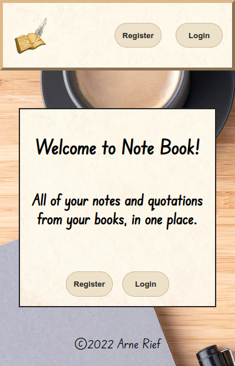
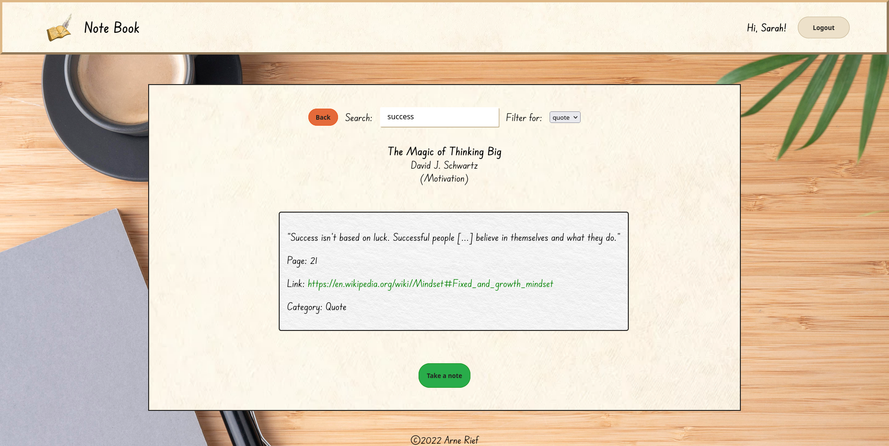

# Note Book

## <a href="https://the-note-book.netlify.app/" target="_blank">Live Demo ▶</a>

## Table of Contents

1. [Live demo](#-live-demo)
2. [Introduction](#-introduction)
3. [Features](#-features)
4. [Installation](#-installing-note-book-locally)
5. [Development info](#-development-info)
6. [Created with](#-created-with)

## Introduction

**Note Book** is a web application for those who like to read a lot and take a lot of notes. Instead of having to skim through the pages of notepads or the books themselves to find that one quotation that you marked down _somewhere_, Note Book allows you to add all your books to a digital collection. From there you can take as many notes for each book as you like, write down your favorite quotes from it and keep everything neatly in one place.

You can also easily search for specific book titles, keywords or text passages and filter between notes and quotes, no matter how big your collection of books grows or how extensive your notes are. Sign up for a free account and browse your book and note collection on your PC, tablet or phone. Let's get reading!

## Features

- Sign up for a free user account
- Add all your books to your personal digital collection
- Access all of your notes & quotations on each book
- Include external links in your notes
- Search tool to find specific book titles or text passages with keywords
- Filter option to choose if only notes or quotes should be displayed
- Fully responsive for a great user experience on desktop, laptop, tablet and mobile devices.

## Installing Note Book locally

After cloning this repository from Github, use the terminal to cd into the cloned parent folder, then run `npm install` inside **both** the /frontend and /backend folders each.

Create a new MySQL database and import the `note-book.sql` file (or copy & paste its content into the new database manually) in order to have the required tables.

In the /backend directory, rename the **.env.sample** file to just **.env** and replace the placeholder values inside with your actual MySQL data and credentials. Additionally uncomment and comment out/delete the respective lines marked in `config.js`.

Similarly rename the **env.sample file in the /frontend directory** to simply .env, this time only changing its content if you prefer to have your backend running on another port than the default port 5000.

Lastly, run `npm start`, again in both the /frontend and /backend folders and keep both terminal tabs/windows open and running while using the application locally.

## Development info

### Frontend

Note Book is a **full-stack web application**, allowing users to sign up for an account and add, store and manage data online. A **React single-page application**, Note Book uses **React Router** to allow the user to navigate to different pages/components in order to sign up, log in, view their books and go to the collection of notes for each book.

To this end, the frontend sends several **axios** requests for individual user data to the backend, storing the data received in React **context**. This is done when signing up for an account, attempting to log in, as well as adding a new book or note/quote to the user's personal collection. Context also takes care of state management for important global data related to re-rendering components as well as for the **search and filter functionalities**.

Context also receives and stores the book collection and all corresponding notes/quotes. Getting this data is triggered not by user input but with the **useEffect hook**, which takes care of the functions for the axios calls and the re-rendering of content when the respective page loads. Determining the data request for the notes on each individual book is done by making use of the dynamic URL parameters with React Router's **useParams hook**.

Almost all styling is done with CSS, utilizing **flexbox, grid and animations** as well as **media queries** to ensure **responsive behavior**. The only exceptions are the modals which appear when adding a new book and new note/quote. Their functionality to open and close as well as their design is achieved with MaterialUI/MUI.

### Backend

For handling the transfer of data from the frontend to the database I have developed a **REST API** with **Node.js** and **Express.js**.

Different routes handle the different kinds of requests coming from the frontend with respective **controller functions**. These asynchronous functions receive the data from the frontend requests in the form of objects, whose values are then used to transmit **create, read and update** operations on the database.

Sensitive data like the user password are encrypted with **bcrypt**, using ten iterations of salting. A middleware function ensures **user authentication with a JSON Web Token**, which is created when logging in, then sent to the frontend to be stored in local storage and again used in post requests to be verified for authenticating the user. Finally the data from successful database queries is sent to the frontend in **JSON** format.

### Database

All data is stored in a **MySQL database** whose three **relational tables** connect the data of a user to the data of their specific books by setting the user ID from the _users_ table as foreign key for the _books_ table. Similarly, the _books_ ID serves as foreign key to the _notes_ table, linking all notes and quotes to the respective book. User email addresses have to be unique and the passwords are stored in encrypted form, as mentioned in the _Backend_ section. Special care was taken to prevent SQL injection attacks by using **parameterized queries** with placeholders.

## Created with

- React v18.2.0
- React Router v6
- JavaScript
- Node.js
- Express.js
- MySQL
- HTML & CSS
- MaterialUI (MUI)

  
<h2 style="display: inline-block">Image sources</h2>

  <ol>
    <li><a href="https://pngtree.com/freepng/cartoon-book-feather-pen-element_5452406.html" target="_blank">Logo</a></li>
    <li><a href="https://i.pinimg.com/564x/f4/11/9d/f4119dafbfac1f45aade91b8528e7214.jpg" target="_blank">Book background</a></li>
    <li><a href="https://www.freepik.com/free-photo/flat-lay-desk-arrangement-with-copy-space_13523365.htm#query=black%20desk&position=0&from_view=keyword" target="_blank">Desk background</a></li>
    <li><a href="https://images.unsplash.com/photo-1581431886281-93ae50c19271?ixlib=rb-1.2.1&ixid=MnwxMjA3fDB8MHxzZWFyY2h8NHx8ZW1wdHklMjBwYWdlfGVufDB8fDB8fA%3D%3D&w=1000&q=80" target="_blank">Note background</a></li>
    <li><a href="https://t4.ftcdn.net/jpg/01/42/71/29/360_F_142712953_1XMycIzw6DswM6in91CnDYt3Ruk0c0QU.webp" target="_blank">Paper cream</a></li>
    <li><a href="https://us.123rf.com/450wm/yamabikay/yamabikay1604/yamabikay160400253/55395574-wei%C3%9Fes-papier-hintergrund-nahtlose-textur-quadrat-tile-bereit-.jpg" target="_blank">Paper white</a></li>
    <li><a href="https://cdn.forumcomm.com/dims4/default/32197a9/2147483647/strip/false/crop/4032x3024+0+0/resize/1486x1115!/quality/90/?url=https%3A%2F%2Fforum-communications-production-web.s3.amazonaws.com%2Fbrightspot%2Fdd%2F61%2F69c037ae41f08c468b9127ce67d5%2F20220124-113904.jpg" target="_blank">Add new book background</a></li>
  </ol>

